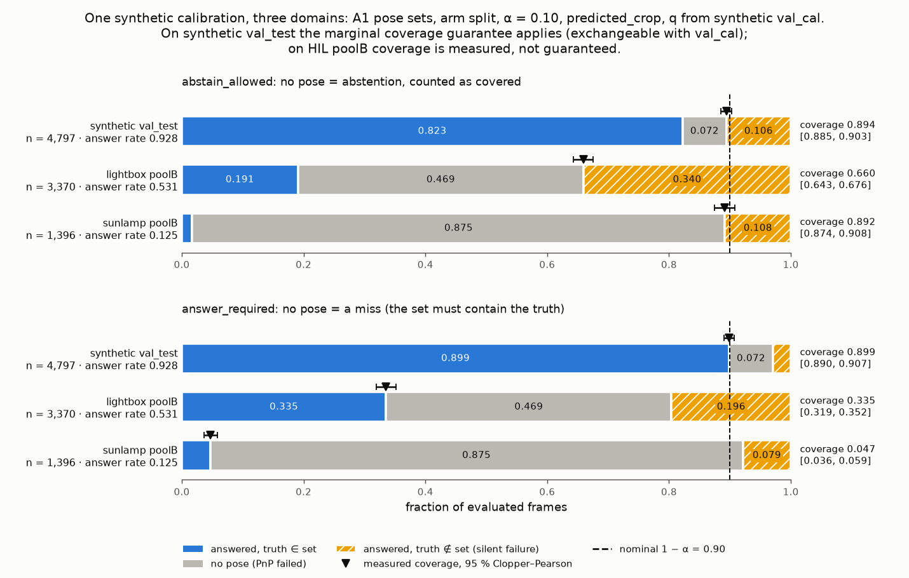
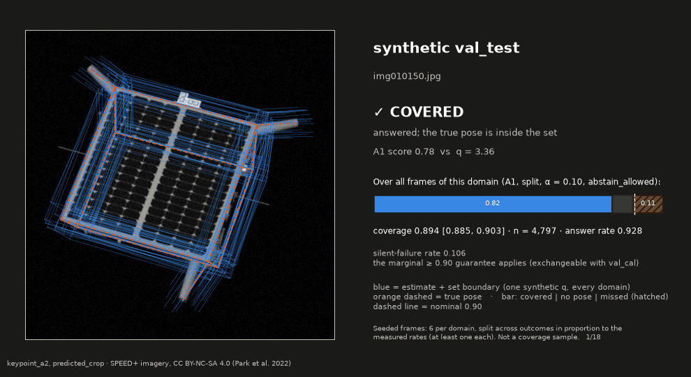
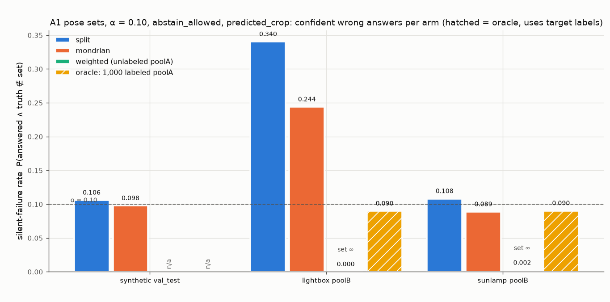
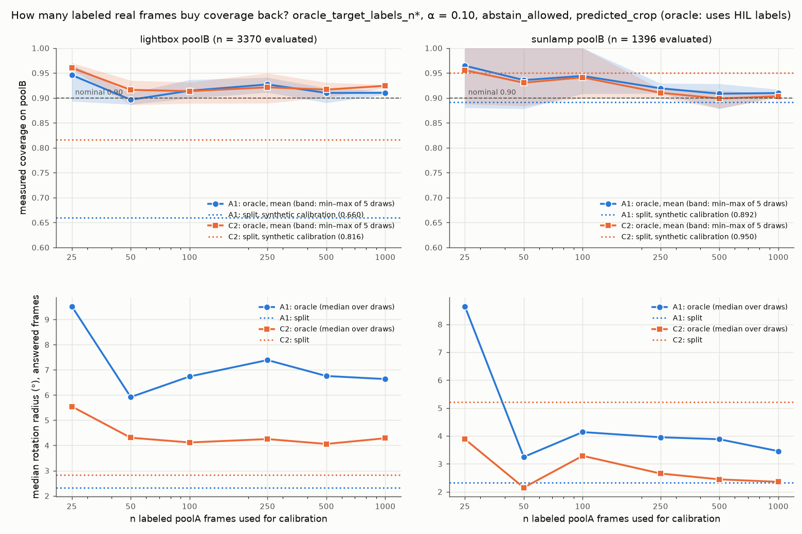
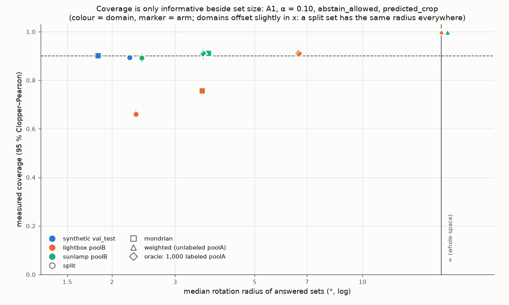
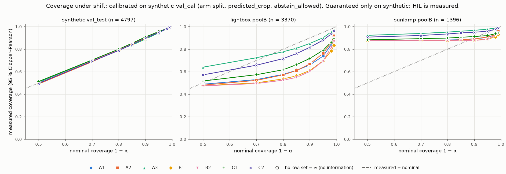
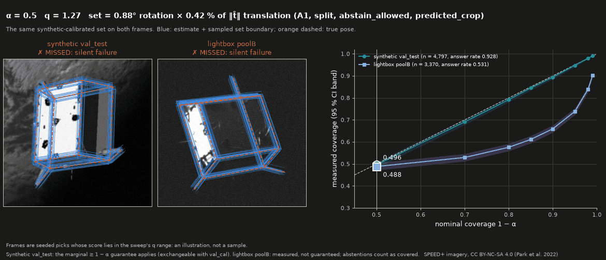
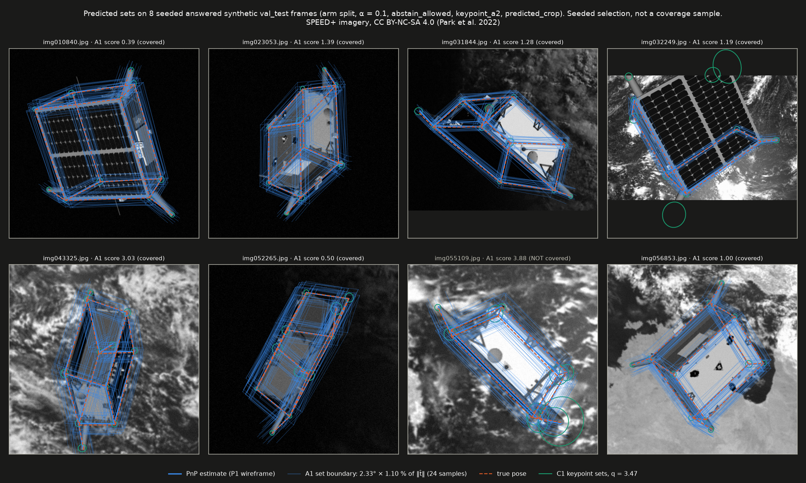
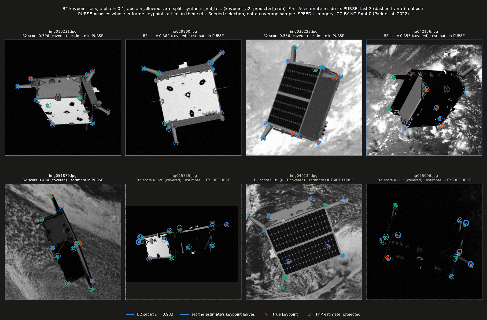

# pose-with-error-bars

Distribution-free error bars for a monocular spacecraft pose pipeline, and a measurement of what
happens to them when the imagery stops being synthetic. A guidance, navigation and control (GNC)
loop that consumes a pose needs to know when to trust it. Split-conformal prediction gives a pose
set with a finite-sample marginal coverage guarantee, but only while calibration and deployment
frames are exchangeable. This repository wraps the frozen pipeline from
[`spacecraft-pose-baseline`](https://github.com/kbasak01/spacecraft-pose-baseline) ("P1"). It
calibrates seven kinds of pose and keypoint sets on synthetic SPEED+ and then measures how their
coverage holds up on the hardware-in-the-loop (HIL) `lightbox` and `sunlamp` domains.

The headline is **the coverage gap under shift**, not a coverage number. The sets are calibrated
for 90 % (A1, `split`, α = 0.10, `abstain_allowed`).
- On synthetic `val_test`, measured coverage is consistent with that: 0.8941 [0.8850, 0.9027],
  n = 4,797.
- On `lightbox` poolB the same sets cover 66.0 % [64.3, 67.6] of 3,370 frames.
- On `sunlamp` poolB they *appear* to cover 89.2 % [87.4, 90.8]. That is only because 87.5 % of
  its 1,396 frames produce no pose: 175 are answered, and 13.7 % of those are covered.



*How to read the chart: every frame each domain was evaluated on, split three ways. Blue: a pose
was produced and the true pose is inside its set. Grey: PnP failed and no pose was produced.
Hatched yellow: a pose was produced and the set misses the truth (a **silent failure**). Under
`abstain_allowed` a grey frame is an abstention and counts as covered, so coverage is blue + grey.
Under `answer_required` it counts as a miss, so coverage is blue only. The ▼ is the measured
coverage with its 95 % Clopper–Pearson interval, and the dashed line is the nominal 0.90. Within
each panel the quantile and the set are identical in all three rows (q = 3.3645 for
`abstain_allowed`, 5.7690 for `answer_required`): one synthetic calibration, applied unchanged.*



*The same A1 pose set (α = 0.10, `abstain_allowed`) on seeded frames from each domain. Blue is
the estimate plus 24 poses sampled on the set boundary, and orange dashed is the true pose. Each
frame is labelled covered, missed (silent failure) or no pose. The frames are seeded, 6 per
domain, and allocated across outcomes in proportion to the measured rates with at least one of
each, so rare outcomes are over-represented. This is **not a coverage sample**. The bar on the
right is computed over all frames. SPEED+ imagery, CC BY-NC-SA 4.0. Regenerate with
`make figures`.*

**Every number on this page is read from a committed file in [`results/`](results/).** Where a
gate is unmet this page says so; no gate was moved. The generated matrix is
[`results/TABLES.md`](results/TABLES.md), and the candid list of what is wrong or unmet is
[`docs/LIMITATIONS.md`](docs/LIMITATIONS.md).

---

## The result: the guarantee holds where it applies, and the gap under shift is large

Settings: A1 pose sets, `split` arm, α = 0.10, `keypoint_a2`, detector-predicted crop (no test
label is used at inference). The quantile is calibrated on 4,798 synthetic `val_cal` frames and
applied unchanged to every domain: q = 3.3645 for `abstain_allowed` and 5.7690 for
`answer_required`. Each row is evaluated on frames that calibration never saw.

| Domain (n evaluated) | Convention | Coverage [95 % CI] | Answer rate | Silent-failure rate | Coverage given answered |
|---|---|---|---|---|---|
| synthetic `val_test` (4,797) | `abstain_allowed` | 0.8941 [0.8850, 0.9027] | 0.928 | 0.106 | 0.886 |
| `lightbox` poolB (3,370) | `abstain_allowed` | **0.6596** [0.6434, 0.6756] | 0.531 | **0.340** | 0.359 |
| `sunlamp` poolB (1,396) | `abstain_allowed` | 0.8918 [0.8744, 0.9076] | **0.125** | 0.108 | **0.137** |
| synthetic `val_test` (4,797) | `answer_required` | 0.8989 [0.8900, 0.9073] | 0.928 | 0.030 | 0.968 |
| `lightbox` poolB (3,370) | `answer_required` | **0.3353** [0.3194, 0.3515] | 0.531 | 0.196 | 0.631 |
| `sunlamp` poolB (1,396) | `answer_required` | **0.0466** [0.0361, 0.0590] | 0.125 | 0.079 | 0.371 |

Source: [`results/shift/keypoint_a2_<domain>_predicted_crop_split.json`](results/shift/).

The set's size is the same on every domain: a 2.33° rotation ball × a 1.10 % of ‖t̂‖ translation
ball under `abstain_allowed`, and 3.99° × 1.89 % under `answer_required`. The radii come from the
same files and from [`results/level_a/`](results/level_a/).

The shipped calibration artifact carries the Phase 2 fit, made from P1's float32 sidecars
(q = 3.36454). The shift matrix refits from the dumps (q = 3.36451). The two sets agree to the
printed precision.

How to read it:
- **Synthetic is the in-distribution check, and it passes.** Coverage is consistent with nominal
  0.90.
  - The 0.8941 here is one draw from the re-split law. The committed A1 split sits at CDF 0.164
    of that law.
  - Over 1,000 random re-splits, the same pipeline is consistent with the exact finite-sample
    law in every non-degenerate cell. That is a per-cell test with no multiplicity correction
    (see *Method*).
- **`lightbox` is the finding.** Nearly two in three answered frames (64.1 %) are silent failures:
  a confident set that misses the truth.
  - That is 34.0 % of all frames, against 10.6 % on synthetic.
  - The miss is not an abstention artefact: given that a pose was produced, coverage is 0.359.
- **`sunlamp` looks fine and is not.** Its near-nominal 0.8918 is almost entirely abstentions:
  only 175 of 1,396 frames produce a pose, and only 0.137 of those are covered. Never quote this
  domain's coverage without the answer rate and n beside it.
- **The two conventions answer different questions.** `abstain_allowed` asks whether the system
  is wrong when it speaks. `answer_required` asks whether the set contains the truth on every
  frame. Every table states which convention it uses, and the two are never mixed.

> ### What the guarantee says, and what it does not
> **It says**, on synthetic `val_test`:
> - Under `abstain_allowed`, the probability that the system either abstains or returns a set
>   containing the true pose is ≥ 1 − α.
> - Under `answer_required`, where a PnP failure counts as a miss, the probability that the set
>   contains the true pose is ≥ 1 − α. For α ≤ 0.05 this holds only because q = +∞ (the whole
>   space).
>
> Both statements are *marginal*: averaged over frames and over the draw of the calibration set.
> Both hold in *finite samples*. Both rest on one assumption: that `val_cal` and `val_test` are
> exchangeable.
>
> The few-label `oracle_target_labels_n*` arms make the same statement *within* a HIL domain:
> calibrate on poolA, evaluate on poolB. Those halves are exchangeable with each other. These arms
> use target labels. Under `answer_required` every oracle q is +∞, so their within-HIL statement
> is met by the whole space.
>
> **It does not say:**
> - anything about `lightbox` or `sunlamp` under synthetic calibration. Those numbers are
>   **measured**, with a Clopper–Pearson interval and n, and carry no guarantee;
> - that coverage holds *conditionally*, for a given frame, range or lighting condition. The
>   conditional slices in [`results/TABLES.md`](results/TABLES.md) show that it does not;
> - that a pose error is bounded. A set is a statement about frequency, not a worst-case bound;
>   the system is not "certified" and not "safe";
> - that P1's model selection preserves exchangeability with a *fresh* synthetic draw. P1 picked
>   its checkpoint using all 11,994 validation frames, and no test on those frames can detect the
>   effect;
> - that high coverage is informative. An ∞ set or an abstention covers trivially, so coverage is
>   only meaningful when read beside set size and answer rate.

---

## What closes the gap, and what does not

Settings: A1, α = 0.10, `abstain_allowed`, predicted crop. Evaluated on n = 3,370 `lightbox`
poolB and 1,396 `sunlamp` poolB frames.

**Non-oracle arms**

| Arm (what it may see) | `lightbox` coverage [CI] | answer rate | silent failure | `sunlamp` coverage [CI] | answer rate (n answered) | silent failure | median rotation radius, answered |
|---|---|---|---|---|---|---|---|
| `split` (synthetic `val_cal`) | 0.6596 [0.6434, 0.6756] | 0.531 | 0.340 | 0.8918 [0.8744, 0.9076] | 0.125 (175) | 0.108 | 2.33° |
| `mondrian` (range × confidence bins, synthetic) | 0.7561 [0.7412, 0.7705] | 0.531 | 0.244 | 0.9112 [0.8950, 0.9256] | 0.125 (175) | 0.089 | 3.57° |
| `weighted_unlabeled_target` (unlabelled poolA images) | 1.0000 [0.9989, 1.0000] | 0.020 | 0.000 | 0.9979 [0.9937, 0.9996] | 0.082 (114) | 0.002 | **∞** |

**Oracle arms (use HIL poolA labels)**

| Arm | `lightbox` coverage [CI] | answer rate | silent failure | `sunlamp` coverage [CI] | answer rate (n answered) | silent failure | median rotation radius, answered (lightbox / sunlamp) |
|---|---|---|---|---|---|---|---|
| `oracle_target_labels_n250` | 0.9271 [0.9009, 0.9487] | 0.531 | 0.073 | 0.9192 [0.8927, 0.9420] | 0.125 (175) | 0.081 | 7.39° / 3.95° |
| `oracle_target_labels_n1000` | 0.9101 [0.8959, 0.9238] | 0.531 | 0.090 | 0.9097 [0.8866, 0.9309] | 0.125 (175) | 0.090 | 6.63° / 3.46° |

Sources: [`results/shift/*_predicted_crop_<arm>.json`](results/shift/) and
[`results/shift/index.json`](results/shift/index.json) (`classifiers`).

How the oracle rows are summarised:
- Coverage, silent-failure rate and answer rate are means over 5 draws.
- The CI is the envelope of the per-draw intervals.
- The radius is the median over draws.
- Under `answer_required` every oracle quantile is +∞, because the target failure rate exceeds α.

- **Bins on predicted range and confidence help, but not enough.** `mondrian` narrows the
  lightbox gap (0.756), but it can only re-weight the synthetic difficulty it has seen.
- **Covariate-shift weighting is degenerate here, and that is a finding about the shift.**
  - A logistic domain classifier on P1's encoder features separates synthetic from HIL almost
    perfectly: 5-fold AUC 0.9834 (lightbox) and 0.9982 (sunlamp).
  - The effective sample size of the 4,798 calibration weights collapses to 1.04 and 1.60. On
    lightbox the largest normalised weight is 0.98.
  - The per-frame quantile is −∞ (abstain) on 90.6 % of lightbox and 16.1 % of sunlamp frames,
    and +∞ (the whole space) on 9.4 % and 83.3 %.
  - The arm answers only 67 of 3,370 lightbox and 114 of 1,396 sunlamp frames, and its median
    answered set is ∞.
  - The coverage near 1 comes from abstentions and ∞ sets, not from recovery.
- **A few hundred labelled real frames bring coverage back, with bigger sets (oracle: uses HIL
  poolA labels).**
  - With 250 labelled poolA frames, the mean over 5 draws is 0.9271 on lightbox poolB and 0.9192
    on sunlamp poolB. Every draw is at or above 0.90 (the lowest are 0.9110 and 0.9090).
  - Single draws still dip below 0.90 at other n. At n = 500, one lightbox draw gives 0.8902 and
    one sunlamp draw 0.8782 ([`results/TABLES.md`](results/TABLES.md)).
  - The cost is a larger set. On lightbox the median rotation radius (median over draws) is
    7.39° at n = 250 and 6.63° at n = 1,000, against 2.33° under synthetic calibration.
- **A learned per-frame normaliser helps on its own.** The C2 pose set divides the error by the
  linearised pose σ̂ from the variance head.
  - On lightbox poolB (`abstain_allowed`, n = 3,370, answer rate 0.531), its split coverage is
    0.8160 [0.8025, 0.8290] with a silent-failure rate of 0.184. A1 gives 0.6596 and 0.340.
  - Under `answer_required`, C2 gives 0.4457 [0.4288, 0.4627] against A1's 0.3353.
  - Its set widens on lightbox: median 2.83° and p90 6.88°, against 1.41° on synthetic.
  - This is the selected head (seed 1337) only. The second seed was evaluated on synthetic only.
  - It is still short of nominal, and still measured, not guaranteed.









*Measured vs nominal coverage across the whole α grid, for all seven scores, under
`abstain_allowed` (the `answer_required` version is
[`assets/shift_coverage_vs_nominal_answer_required.png`](assets/shift_coverage_vs_nominal_answer_required.png)).
Hollow markers are ∞ sets.*

### Gallery



*α runs from 0.50 to 0.01. One seeded synthetic frame and one lightbox frame are shown with the A1
set at each α's quantile. Each was chosen because its score lies inside the sweep's q range, so
this is an illustration, not a sample. On the right is measured coverage for all evaluated frames
(`split`, `abstain_allowed`). On lightbox poolB (n = 3,370, answer rate 0.531), measured coverage
first reaches 0.90 at nominal 0.99: 0.9015 [0.8909, 0.9113] with a 6.30° × 2.98 % set, against
0.6596 at nominal 0.90. SPEED+ imagery, CC BY-NC-SA 4.0.*



*A1 pose sets and C1 keypoint sets on 8 seeded synthetic `val_test` frames (`split`, α = 0.10,
`abstain_allowed`). Seeded selection, not a coverage sample. SPEED+ imagery, CC BY-NC-SA 4.0.*



*B2 keypoint ellipses on synthetic `val_test` (α = 0.10, `abstain_allowed`). The pose set they
induce is a PURSE, following Yang & Pavone. As implemented here it is **unbounded**: a pose that
projects no constrained keypoint into the frame meets no constraint
([`docs/SCORES.md`](docs/SCORES.md)). That is why Level B reports pose-space radii only as
approximations near the PnP estimate. SPEED+ imagery, CC BY-NC-SA 4.0.*

---

## Method

| Level | Scores | Set | What it needs at test time |
|---|---|---|---|
| A: pose space | A1 rotation ball × translation ball; A2 ball × boresight/lateral cylinder; A3 A1 scaled by a confidence-difficulty function | a ball around the PnP pose, translation normalised by predicted ‖t̂‖ | the pose and the mean keypoint confidence |
| B: keypoint space | B1 11 discs scaled by the predicted box; B2 11 Mahalanobis ellipses from the heatmap moments | joint keypoint set → pose set (PURSE) | P1's heatmaps |
| C: learned uncertainty | C1 B2 with a learned per-keypoint Σ̂; C2 the pose error normalised by the linearised pose σ̂ | keypoint ellipses / pose box | a variance head on P1's frozen decoder |

Each score is defined in [`docs/SCORES.md`](docs/SCORES.md).
- **Label-free sets.** The function that builds a set takes predictions and a quantile and never a
  label. A test enforces this for all seven scores.
- **The quantile.** It is the exact ⌈(n+1)(1−α)⌉-th order statistic in rationals, and +∞ when that
  index exceeds n. It is never `np.quantile`.
- **PnP failures are never dropped.** Every frame gets a score: +∞ under `answer_required` (the
  set must contain the truth) or −∞ under `abstain_allowed` (the system may say "no pose").
- **Calibration arms.** `split`, `mondrian`, `weighted_unlabeled_target` (Tibshirani et al. 2019)
  and `oracle_target_labels_n*`. The last reads HIL poolA labels and is tagged as an oracle
  everywhere.
- **The variance head never changes the pose.** P1's coordinates are bit-identical with and
  without the head, and a test pins this. The head is trained with β-NLL (Seitzer et al. 2022).

**In distribution** (synthetic `val_test`, `split`, predicted crop, n = 4,797, answer rate
0.9285, α = 0.10, `abstain_allowed`; C1/C2 use the variance head with seed 1337). The keypoint
rows give the largest keypoint radius:

| Score | Coverage [95 % CI] | Set size (median) |
|---|---|---|
| A1 | 0.8941 [0.8850, 0.9027] | 2.33° × 1.10 % of ‖t̂‖ |
| A2 | 0.8993 [0.8904, 0.9077] | 2.83°; boresight 1.27 %, lateral 0.23 % |
| A3 | 0.8891 [0.8799, 0.8978] | 2.13° × 1.01 % |
| B1 | 0.8943 [0.8853, 0.9029] | 15.7 px |
| B2 | 0.8985 [0.8896, 0.9069] | 16.4 px |
| C1 | 0.9079 [0.8993, 0.9159] | 20.0 px |
| C2 | 0.8981 [0.8892, 0.9065] | 1.41° × 1.40 % of ‖t̂‖ |

Sources: [`results/level_a/`](results/level_a/), [`results/level_b/`](results/level_b/) and
[`results/level_c/`](results/level_c/). The A3 row's interval lies below 0.90. Its fixed split
sits at CDF 0.0386 of the exact re-split law: one low draw from a valid law, not a validity
failure.

**Validity is tested, not assumed.**
- *Re-splits.* `val_cal ∪ val_test` was re-split 1,000 times and compared with the exact
  atom-aware Beta-Binomial law. Verdicts (VALID / DEGENERATE / DEVIATES): Level A 39 / 9 / 0,
  Level B 26 / 6 / 0, Level C (selected head, seed 1337) 26 / 6 / 0. DEGENERATE means `answer_required` at α ≤ 0.05, where
  q = +∞ because the 7.2 % PnP failure rate exceeds α.
  ([`assets/validity_*.png`](assets/), [`results/validity/`](results/validity/).)
- *Synthetic data.* The conformal core passes 16 / 16 validity cases with known coverage
  ([`results/validity/conformal_core_synthetic.json`](results/validity/conformal_core_synthetic.json)).
- *Variance head vs heatmap moments.* The learned Σ̂ beats the heatmap-moment covariance on
  `val_test` NLL (3.054 vs 5.432 nats/keypoint). It also ranks error better: Spearman(σ̂, ‖r‖)
  0.520 vs 0.385. It is not a calibrated Gaussian (1σ ellipse reliability 0.520 against 0.393),
  and the conformal step is what makes its sets valid in distribution (synthetic `val_test`).

### Relative to prior work

| | Uncertainty object | Evaluated on |
|---|---|---|
| Yang & Pavone, CVPR 2023 | conformal keypoint sets → pose uncertainty set (PURSE); RANSAG average pose; SDP worst-case bounds | object-pose benchmarks (see the paper) |
| Wang et al., ICCV 2025 | conformal keypoint regions → ellipsoidal pose confidence regions via the implicit function theorem | LineMOD-Occlusion and the original SPEED |
| This repository | pose-space sets (A), keypoint sets / PURSE (B) and learned-Σ̂ normalisers (C), side by side on one frozen pipeline | SPEED+ synthetic → `lightbox` / `sunlamp` HIL |

What this repository adds on top of that line of work:
- **coverage measured under a real sim-to-HIL shift**, with Clopper–Pearson intervals, answer
  rates and silent-failure rates, plus Mondrian, covariate-shift-weighted and few-label arms;
- **explicit PnP-failure conventions** (`answer_required` / `abstain_allowed`), so that no frame
  is ever dropped;
- **a learned heteroscedastic keypoint head** used as a conformal normaliser on a frozen network;
- **deployment**: hash-locked calibration artifacts, an ONNX variance graph and a latency budget.

The contribution here is *not* a tighter set. Level B's PURSE and the linearised extent follow
those papers, and no numeric comparison against them was run: Wang et al.'s code was not used, and
the datasets differ. What is new is the measured behaviour of distribution-free pose sets across a
real sim-to-HIL shift, reported as measured coverage with intervals, answer rates and silent
failures rather than as a guarantee.

---

## Deployment and latency

> **The RTX A4000 is not a Jetson.** Every figure here was measured on a desktop RTX A4000 (16 GB,
> 140 W) and its host CPU under WSL2. It stands in for a Jetson-class target and is not a proxy for
> one: the absolute milliseconds will **not** transfer. The ratios (head on vs off, post-process
> vs network) and the shape of the frame budget are more likely to carry over than absolute times;
> this was not measured on a Jetson.

The per-frame cost of uncertainty is small next to what P1 already spends. Measurements: batch 1,
≥ 50 warmup and ≥ 500 timed iterations, from [`results/latency/`](results/latency/):

| Stage | Head off | Head on (C1 + C2) |
|---|---|---|
| Keypoint network, TensorRT fp32, p50 | 1.128 ms | 1.289 ms |
| Keypoint network, ORT CUDA fp32, p50 | 1.891 ms | 2.102 ms |
| `ConformalPoseHead.predict`, CPU, p50 | — | C1 0.112 ms, C2 0.640 ms (C2 includes the linearisation) |
| Full frame, ORT CUDA fp32, p50 / p99 | 14.64 / 65.26 ms | 16.28 / 66.05 ms |

—: the head-off pipeline has no uncertainty stage.

PnP still dominates the tail at 49.45 ms p99 with the head off. The sampled pose-set estimator
(26.7 ms p50 at M = 256) is offline only.

**What ships.** `ConformalPoseHead` loads one JSON artifact per deployable score × convention:
12 in all, every score except B2. Each artifact is locked to the SHA-256 of P1's keypoint and
detector checkpoints, and the C1/C2 artifacts also to the variance-head checkpoint. The loader
refuses a mismatch. A `val_test` replay through the artifacts reproduces every committed
row exactly ([`results/calibration/index.json`](results/calibration/index.json)). B2 is not
deployable, because the exported graph does not output heatmap moments.

**The fp32 variance parity gate is unmet, and it stays unmet.** ONNX Runtime CUDA vs PyTorch, with
TF32 off on both sides, gives `cov_chol` max |Δ| 2.86e-3 against a 1e-4 gate. The shipped quantity,
the C1 set radius, agrees to 6.95e-5 relative. fp16 is **not** a deployment option for the
variance outputs: the C1 radius moves by up to 8.3 %
([`results/export/onnx_parity.json`](results/export/onnx_parity.json)). P1's own keypoint parity
miss is inherited.

---

## Reproducing this

**Without the dataset or a GPU.** This is the clean-clone gate that CI runs:

```bash
git clone --recurse-submodules https://github.com/kbasak01/pose-with-error-bars.git
cd pose-with-error-bars
python3.11 -m venv .venv && source .venv/bin/activate
pip install -r external/spacecraft-pose-baseline/requirements-ci.txt   # P1's CPU pins
pip install -e external/spacecraft-pose-baseline --no-deps            # P1, read-only
pip install -r requirements-extra.txt -c external/spacecraft-pose-baseline/requirements-ci.txt
pip install -e . --no-deps

make lint && make smoke      # conformal core, adapter, head, fixtures: no dataset, no GPU
make tables                  # regenerates results/TABLES.md from the JSON (CI checks it is byte-identical)
```

**With SPEED+ and P1's checkpoints.** Download SPEED+ yourself (see `SOURCES.md`) and P1's
`phase-9-complete` release. Point `configs/paths.local.yaml` at both (the file is gitignored).
Then:

```bash
make verify-p1       # P1 checkpoint SHA-256 vs its release manifest
make splits-check    # split manifests regenerate byte-identically
make level-a         # Phase 2, CPU, from P1's committed sidecars
make dump            # prints the GPU dump command; run it yourself
make parity-p1       # gate: the dump reproduces P1's per-sample results
make level-b
make train-var       # prints the GPU training command (~10 min on an A4000)
make dump-var        # prints the variance sidecar command
make level-c shift-matrix calibration
make tables figures  # results/TABLES.md and assets/ from the JSON
```

`make export`, `make parity-onnx` and `make bench` print their GPU commands. TensorRT is needed for
the TensorRT rows. Everything is seeded (1337; splits 20261006), and the environment is captured in
[`docs/ENVIRONMENT.md`](docs/ENVIRONMENT.md).

### Release assets

**[phase-9-complete](https://github.com/kbasak01/pose-with-error-bars/releases/tag/phase-9-complete)**
holds 15 assets and `SHA256SUMS.txt`:
- the 12 calibration artifacts and their index;
- the selected variance-head checkpoint `vhead_a2_s1337_best.pt`;
- its fp32 ONNX graph `vhead_a2_s1337.onnx`.

The same manifest is committed as
[`results/release/SHA256SUMS.txt`](results/release/SHA256SUMS.txt). The checkpoint hash equals
the lock inside every C1/C2 artifact, and the graph hash equals
[`results/export/onnx_export.json`](results/export/onnx_export.json). The assets can therefore be
verified against the repository rather than trusted:

```bash
sha256sum -c SHA256SUMS.txt
```

Nothing on this page depends on that download. P1's detector and keypoint checkpoints come from
P1's own release.

---

## Limitations

The full list, with a per-item verdict for all 58 lines of `VALIDATION_CHECKLIST.md`, is
[`docs/LIMITATIONS.md`](docs/LIMITATIONS.md). These are the items that should change how you read
this page:

- **Single pose model.** Every conclusion is about P1 `keypoint_a2` with its detector, on SPEED+.
  Nothing here generalises to keypoint pipelines as a class.
- **HIL is not flight.** `lightbox` and `sunlamp` are laboratory imagery of a mock-up. The
  measured gap is evidence about *this* synthetic → HIL shift, not about orbit.
- **Exchangeability is approximate even in distribution.** P1 selected its checkpoint on all
  synthetic validation frames. `val_cal` → `val_test` coverage is still valid between those frames,
  but a fresh synthetic draw may differ, and no test on those frames can show it.
- **`sunlamp` is small after PnP failures.** 175 of 1,396 poolB frames are answered, and the
  coverage-given-answered intervals are wide. Read every sunlamp number with its n.
- **The weighted arm is degenerate at this shift** (ESS 1.04 / 1.60). Clipping or other features
  would be new design choices, and they could not be tuned on HIL without leakage, so none were
  tried.
- **The fp32 variance ONNX parity gate is unmet** (2.86e-3 vs 1e-4; root-caused, not loosened).
  P1's keypoint parity miss is inherited.
- **Two variance-head seeds give a range, not a variance estimate.** Seed 2026 reproduces the
  Phase 5 head-quality and coverage conclusions on synthetic `val_test`: NLL 3.073 vs 3.054, and
  C1 coverage 0.9087 vs 0.9079
  ([`results/level_c/variance_head_seed_spread.json`](results/level_c/variance_head_seed_spread.json)).
  One of its re-split cells is reported as DEVIATES, and that verdict was kept.
- **The A4000 is not a Jetson,** and the frame budget gives p50/p99 only.
- **Out of scope by design:** retraining P1, domain adaptation and "improving" PnP. The gap above
  is what conformal calibration alone does and does not fix.

---

## Attribution and licence

Code in this repository is **MIT** licensed (see [`LICENSE`](LICENSE)). P1
([`spacecraft-pose-baseline`](https://github.com/kbasak01/spacecraft-pose-baseline), MIT) is
included unmodified as a git submodule pinned at `phase-9-complete`.

The **SPEED+** dataset is **CC BY-NC-SA 4.0** from the Stanford Digital Repository
([purl.stanford.edu/wv398fc4383](https://purl.stanford.edu/wv398fc4383)), and it is **not
redistributed here**. The NonCommercial and ShareAlike terms attach to anything derived from its
imagery: the image figures and GIFs in `assets/`, the variance-head weights and the ONNX graph in
the release.

> Park, Märtens, Lecuyer, Izzo & D'Amico, *SPEED+: Next-Generation Dataset for Spacecraft Pose
> Estimation across Domain Gap*, Stanford Digital Repository,
> <https://purl.stanford.edu/wv398fc4383>, CC BY-NC-SA 4.0.

### Citations

- Park, Märtens, Lecuyer, Izzo & D'Amico (2022). *SPEED+: Next-Generation Dataset for Spacecraft
  Pose Estimation across Domain Gap.* IEEE Aerospace Conference.
  DOI [10.1109/AERO53065.2022.9843439](https://doi.org/10.1109/AERO53065.2022.9843439)
- Yang & Pavone (2023). *Object Pose Estimation with Statistical Guarantees: Conformal Keypoint
  Detection and Geometric Uncertainty Propagation.* CVPR. arXiv:[2303.12246](https://arxiv.org/abs/2303.12246)
- Wang, Li, Wang, Guan, Shang & Yu (2025). *Deterministic Object Pose Confidence Region
  Estimation.* ICCV. arXiv:[2506.22720](https://arxiv.org/abs/2506.22720)
- Tibshirani, Barber, Candès & Ramdas (2019). *Conformal Prediction Under Covariate Shift.*
  NeurIPS. arXiv:[1904.06019](https://arxiv.org/abs/1904.06019)
- Angelopoulos & Bates. *A Gentle Introduction to Conformal Prediction and Distribution-Free
  Uncertainty Quantification.* arXiv:[2107.07511](https://arxiv.org/abs/2107.07511)
- Seitzer, Tavakoli, Antic & Martius (2022). *On the Pitfalls of Heteroscedastic Uncertainty
  Estimation with Probabilistic Neural Networks.* ICLR. arXiv:[2203.09168](https://arxiv.org/abs/2203.09168)
- Context: Barber, Candès, Ramdas & Tibshirani (2023), *Conformal prediction beyond
  exchangeability*, arXiv:[2202.13415](https://arxiv.org/abs/2202.13415); Gao, Tang, Qi & Yang
  (2024), *CLOSURE*, arXiv:[2403.09990](https://arxiv.org/abs/2403.09990). The full reading list
  is in [`SOURCES.md`](SOURCES.md).

### Project documentation

| What | Where |
|---|---|
| All result tables, generated from JSON | [`results/TABLES.md`](results/TABLES.md) |
| Raw results, every JSON committed | [`results/`](results/) |
| Score definitions | [`docs/SCORES.md`](docs/SCORES.md) |
| What is wrong, unmet, or owed | [`docs/LIMITATIONS.md`](docs/LIMITATIONS.md) |
| Why each non-obvious choice was made | [`docs/DECISIONS.md`](docs/DECISIONS.md) |
| Phase status and key numbers | [`docs/PROGRESS.md`](docs/PROGRESS.md) |
| Recalibrating the head for a new target | [`docs/RECALIBRATION_EXAMPLE.md`](docs/RECALIBRATION_EXAMPLE.md) |
| The plan of record | [`IMPLEMENTATION_PLAN.md`](IMPLEMENTATION_PLAN.md) |
